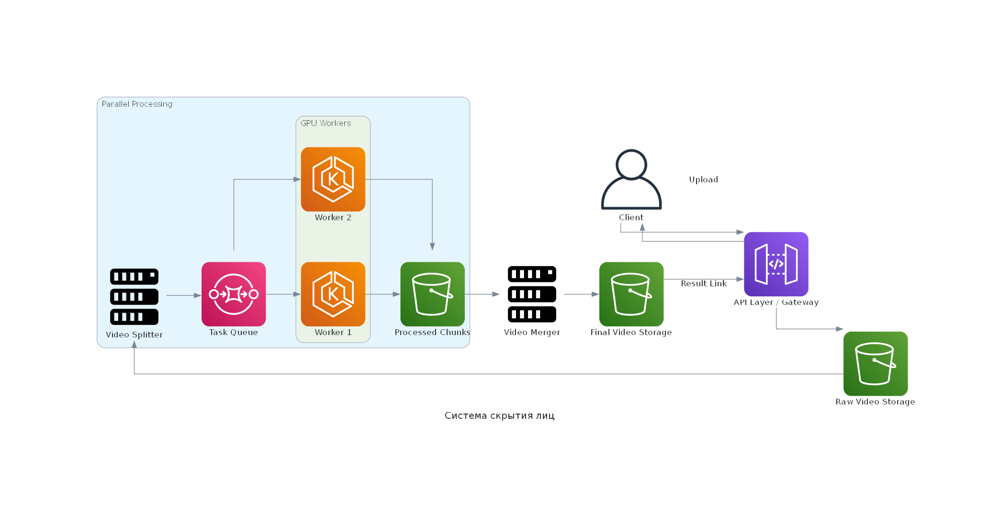

# ML DevOps Project

Учебный проект по разработке воспроизводимой ML-системы. 
В проекте собраны пять частей: сравнение notebook-подхода с Marimo, 
DVC/MLflow pipeline, Feature Store на Feast + PostgreSQL, 
оценка готовности к production и схема ML-системы для блюра лиц на видео.

## Структура проекта

```text
.
├── src/                         # ML pipeline
│   ├── prepare.py               # подготовка данных и train/test split
│   ├── train.py                 # обучение модели и логирование в MLflow
│   └── evaluate.py              # оценка модели и сохранение метрик
├── data/                        # данные под управлением DVC
│   ├── raw/                     # исходные данные
│   └── processed/               # train.csv / test.csv
├── model/                       # model.pkl, генерируется pipeline
├── report/                      # metrics.json
├── local_repo/feature_repo/     # Feast feature repository
│   ├── feature_definitions.py   # Entity, FeatureView, FeatureService
│   └── feature_store.yaml       # PostgreSQL registry/offline/online store
├── scripts/                     # скрипты Feature Store
│   ├── seed_postgres.py         # генерация и загрузка данных в PostgreSQL
│   ├── apply.py                 # применение Feast-конфигурации
│   └── materialize.py           # материализация признаков в online store
├── diagram/                     # схема ML-системы блюра лиц
├── dvc.yaml                     # DVC pipeline
├── params.yaml                  # параметры пайплайна
├── requirements.txt             # основные зависимости
└── run_*.bat                    # Windows-обёртки для запуска команд
```

## Задание 1. Colab/Jupyter vs Marimo

Классические ноутбуки, такие как Google Colab и Jupyter, ориентированы на 
линейное выполнение ячеек, тогда как Marimo использует граф зависимостей.
В ноутбуках порядок выполнения задаётся вручную, а в Marimo пересчёт 
происходит автоматически при изменении данных. В ноутбуках сложно 
гарантировать воспроизводимость, 
так как результат зависит от порядка выполнения ячеек и состояния ядра.
В Marimo состояние вычисляется заново, обеспечивая предсказуемость результатов.
С точки зрения интерфейса ноутбуки в основном статичны, а в Marimo есть 
реактивные UI-элементы, связанные с кодом. Однако такая модель требует 
строгого соблюдения зависимостей: UI-элементы нужно создавать в одной 
ячейке, а использовать в другой, иначе возникают ошибки выполнения. 
  
Интересные возможности SQL-ячеек, где можно добавлять подключения к БД, и
работа с БД будет встроена в RAG. Формат .ipynb неудобен для Git и 
командной разработки, в отличие от `.py` файлов Marimo.
Ноутбуки часто используются как смесь кода и заметок, но их сложно 
поддерживать как документацию. В Marimo код и пояснения можно использовать и как презентацию, и как 
документацию (режим Toggle App View). 
Еще стоит добавить, ноутбуки плохо подходят для интеграции в 
production-пайплайны, так как не являются модульным кодом.

Итого, к Marimo нужно привыкнуть после анархии 
обычных notebook. Здесь переменные объявляются один раз, а зависимости 
между ячейками автоматически управляют порядком выполнения, 
нельзя читать значения UI в той же ячейке и 
дублировать переменные. Все нюансы не успел опробовать.

## Задание 2. Воспроизводимость через DVC и MLflow

ML pipeline разделён на три стадии:

```text
prepare → train → evaluate
```

- `prepare` читает `data/raw/bank_clients.csv`, очищает данные и создаёт `data/processed/train.csv` и `data/processed/test.csv`.
- `train` обучает `RandomForestClassifier`, сохраняет `model/model.pkl` и логирует параметры/модель в MLflow.
- `evaluate` загружает модель, считает `accuracy`, `precision`, `recall`, `f1`, `roc_auc` и сохраняет `report/metrics.json`.

Основные команды:

```bash
# запуск MLflow UI
run_mlflow.bat

# воспроизвести pipeline
run_dvc.bat repro

# запустить эксперимент без загрязнения workspace
run_dvc.bat exp run --temp -S train.random_forest.n_estimators=300

# посмотреть эксперименты
run_dvc.bat exp show --only-changed

# сохранить лучший эксперимент как Git-ветку
run_dvc.bat exp branch <exp_name> exp_best
git checkout exp_best
run_dvc.bat checkout
```

В DVC `report/metrics.json` указан как `metrics`, поэтому метрики корректно отображаются в `dvc exp show`.

Практические проблемы DVC и решения:

- `dvc exp run` меняет workspace, поэтому проще использовать 
  `dvc exp run --temp`.
- `exp apply` на Windows нестабилен из-за lock-файлов, поэтому 
  использую `exp branch + git checkout`.
- `dvc exp show` выводит слишком много колонок, поэтому удобно 
  использовать `--only-changed`, а метрики вынесены в `metrics:`.
- Вложенные параметры чувствительны к пути, поэтому используется полный 
  путь вроде `train.random_forest.n_estimators` и секция `params: - train`.
- Для Windows добавлены `.bat`-обёртки, чтобы фиксировать рабочую 
  директорию и Python из локального `.venv`. Кроме этого это решает 
  проблему использования .env и это просто удобно. 

## Задание 3. Feature Store на Feast и PostgreSQL

Реализован Feature Store для статистики водителей. 
Проект вначале для тренировки сделан на файловом варианте и затем 
переведён на PostgreSQL: registry, offline store и online store 
описаны в `feature_store.yaml`.

Отмечу, в проекте DVC и Feature Store показаны как два отдельных 
MLOps-компонента. DVC используется для воспроизводимости 
ML-пайплайна на датасете bank_clients, 
а Feast + PostgreSQL демонстрирует отдельный слой управления 
признаками на примере driver statistics. Данные для `feature_definitions.py`
взяты из учебного ноутбука, прилагаемого к заданию. 

Основные компоненты:

- `feature_definitions.py` — описание `driver` entity, 
  `driver_hourly_stats` FeatureView, request source, on-demand feature 
   view и FeatureService `driver_activity_v1`.
- `seed_postgres.py` — генерирует тестовые данные и загружает их в 
   таблицу `feast_driver_hourly_stats`.
- `apply.py` — применяет определения Feast к registry.
- `materialize.py` — переносит последние значения признаков в online store для быстрого получения на инференсе.
  (Для запусков скриптов можно использовать`run_feast.bat`)
Для локального запуска нужен `.env`:

```ini
DB_USER=tuser
DB_PASSWORD=12345
DB_HOST=localhost
DB_PORT=5432
DB_NAME=mydb
```

Запуск:

```bash
python scripts/seed_postgres.py
python scripts/apply.py
python scripts/materialize.py
```

Feast UI:

```bash
run_feast_ui.bat
```

## Задание 4. Готовность ML-системы к production

ML-система включает не только модель, но и данные, 
подготовку признаков, обучение, валидацию, хранение артефактов, 
Feature Store, инференс и инфраструктуру. 
В проекте уже есть воспроизводимый DVC pipeline, MLflow tracking, 
Feature Store на Feast/PostgreSQL, параметры в `params.yaml`, 
сохранение модели и метрик. Это лучше, чем вариант “репозиторий + Colab”, 
потому что проект можно воспроизвести через `git clone`, 
установку зависимостей, `dvc pull` и `dvc repro`. 
При этом система ещё не полностью готова к production: 
нет Docker-образа, CI/CD, внешнего общего DVC remote, 
inference API, мониторинга качества, мониторинга drift 
и нормального управления секретами. 
Итог: проект готов как учебный MLOps-прототип и база для деплоя, 
но еще требует доработки.

## Задание 5. Схема ML-системы для блюра лиц на видео

Архитектура системы для автоматического заблюривания лиц на видео:

### Основные компоненты

1. **Client / API**  
   Пользователь загружает видео через интерфейс или API.

2. **Raw Video Storage**  
   Исходное видео сохраняется во временное хранилище, например S3/MinIO 
3. или локальное файловое хранилище.

3. **Video Splitter**  
   Видео разбивается на короткие чанки с помощью FFmpeg, чтобы обработку 
   можно было распараллелить.

4. **Task Queue**  
   Очередь задач хранит ссылки на видеофрагменты, ожидающие обработки. 
   Для этого можно использовать RabbitMQ, Kafka.

5. **GPU Workers**  
   Обработчики забирают чанки из очереди, находят лица с помощью модели 
   детекции лиц и накладывают blur.

6. **Processed Video Storage**  
   Обработанные чанки сохраняются отдельно от исходного видео.

7. **Video Merger**  
   FFmpeg собирает обработанные чанки обратно в итоговое видео и 
   возвращает оригинальную аудиодорожку.

8. **Result API / UI**  
   Пользователь получает ссылку на готовое заблюренное видео.

### Схема
<div align="center">
  
</div>


### Логика работы

Видео поступает от клиента, сохраняется в хранилище и разбивается на части. 
После этого каждый чанк отправляется в очередь задач и обрабатывается GPU 
worker-ами. На каждом фрагменте модель детектирует лица, после чего на 
найденные области накладывается размытие. Обработанные чанки сохраняются 
в отдельное хранилище, затем собираются обратно в один видеофайл. 
Такой подход позволяет обрабатывать длинные видео параллельно и 
масштабировать систему количеством GPU worker-ов.


## Воспроизведение проекта

```bash
git clone <repo>
cd <repo>
python -m venv .venv
.venv\Scripts\activate
pip install -r requirements.txt
dvc pull
dvc repro
```

Важно: текущий DVC remote настроен как локальный filesystem remote. 
Для запуска на другой машине нужен доступ к тому же remote или перенос 
данных в общий remote.


